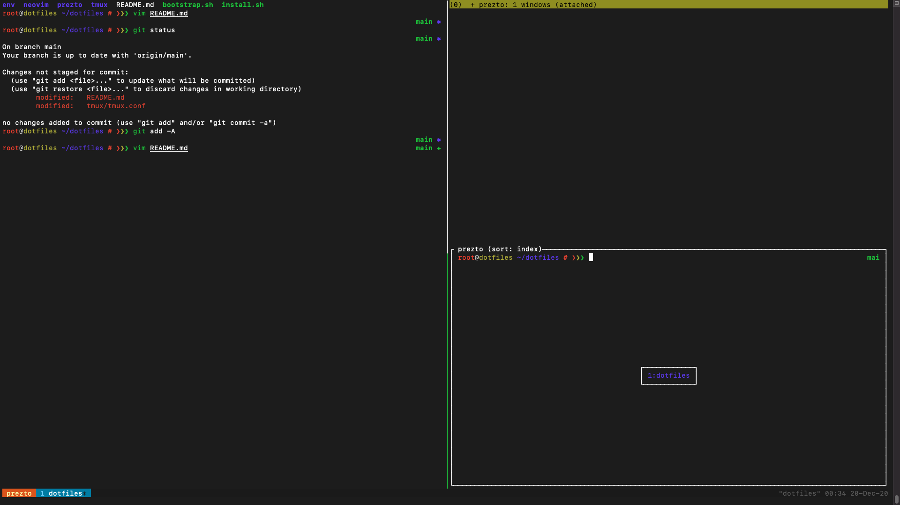

# dotfiles

Scripts and configurations for bootstrapping a new nix environment.

___

To install run:

1. The environment's corresponding command.

| Environment | Description | Command |
| --- | --- | --- |
| Agnostic | Minimal install for any Ubuntu system | `curl -s https://raw.githubusercontent.com/iainwo/dotfiles/main/bootstrap.sh \| bash` |
| Development Droplet | Install some languages and common infrastructure tools for devel | `curl -s https://raw.githubusercontent.com/iainwo/dotfiles/main/bootstrap.sh \| INSTALL_PYTHON=Y INSTALL_GOLANG=Y INSTALL_KUBERNETES=Y INSTALL_DOCTL=Y bash` |
| Blog Droplet | Install NeoVim + Jekyll | `curl -s https://raw.githubusercontent.com/iainwo/dotfiles/main/bootstrap.sh \| INSTALL_PYTHON=Y INSTALL_GOLANG=Y INSTALL_KUBERNETES=Y INSTALL_DOCTL=Y bash` |

2. Exit and re-enter SSH connection or Shell

___

Manual:

- `Ctrl-Space` is the tmux prefix
- `Ctrl-Space` + `|` to tmux vsplit 
- `Ctrl-Space` + `_` to tmux hsplit 
- `v`/`vi`/`vim`/`nvim` to open neovim
- use `extract` bash function to unpack/extract any archives (.tar, .tar.gz, etc.)

Upgrading Plugins:

1. <kbd>prefix</kbd>–<kbd>I</kbd> # to install tmux plugins
2. <kbd>prefix</kbd>–<kbd>U</kbd> # to update tmux plugins
3. nvim
  1. :PlugInstall # to install neovim plugins
  2. :PlugUpdate
  3. :PlugClean # remove plugins
  4. :PlugStatus
  5. :PlugUpgrade # upgrade vim-plug

Programs Installed:

- git
- zsh
  - prezto
- tmux
  - tmux plugin manager
  - tmux yank for copy from tmux buffers to system clipboard
- neovim
  - vim plug
- conda

___

TODO:

- [x] config tmux
- [x] config tmux plugin manager
- [x] config neovim
- [ ] zsh auto suggestions
- [ ] tmuxp
- [ ] zsh jump table to popular directories
- [ ] backup and restore functionality?
- [ ] update functionality (or docs)?
